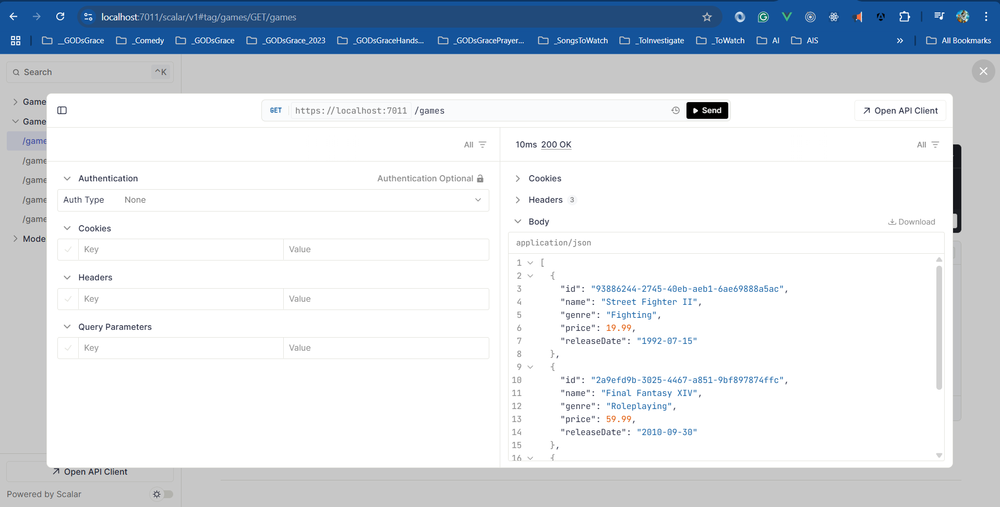

# Game Store API v1.0

I am learning .NET 10 Minimal API from different Video Courses, Books, and Websites.

## To do

- Implement error handling
- Add unit tests
- Implement logging and monitoring
- Add authentication and authorization

## How to execute

